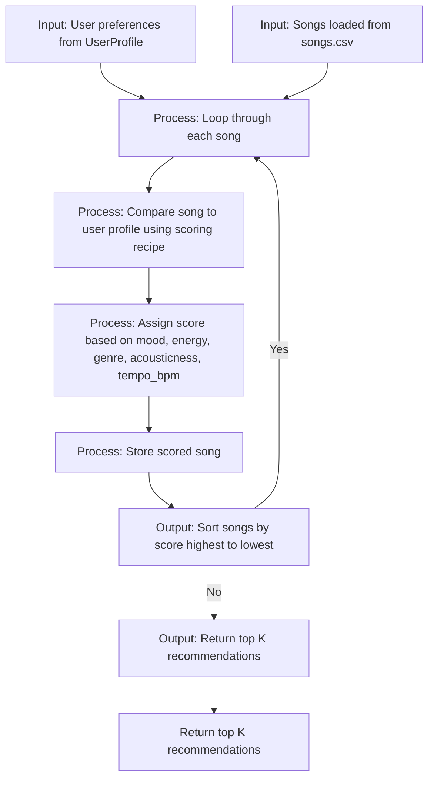

```mermaid
flowchart TD
A[Input: User preferences from UserProfile]
B[Input: Songs loaded from songs.csv]
C[Process: Loop through each song]
D[Process: Compare song to user profile using scoring recipe]
E[Process: Assign score based on mood, energy, genre, acousticness, tempo_bpm]
F[Process: Store scored song]
G[Output: Sort songs by score highest to lowest]
H[Output: Return top K recommendations]
I[Return top K recommendations]

    A --> C
    B --> C
    C --> D
    D --> E
    E --> F
    F --> G
    G -->|Yes| C
    G -->|No| H
    H --> I
```
